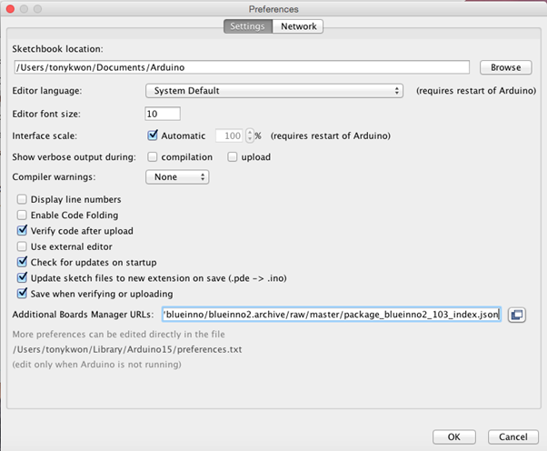

# Blueinno2 Open Source Hardware


[Youtube Video](https://youtu.be/Fk3yi3VuR14)  

## Conctact

[Blueinno Cafe](http://cafe.naver.com/arduinoplusble).

## Installation

* Install the [FTDI drivers](http://www.ftdichip.com/Drivers/VCP.htm).

* Download [Arduino 1.6.6](http://arduino.cc/en/Main/Software) or newer.
  * _Mac OS X_: Requires Java 6 to be installed. Available [en_US](https://support.apple.com/kb/DL1572?locale=en_US).
  * _Mac OS X_: Requires Java 6 to be installed. Available [ko_KR](https://support.apple.com/kb/DL1572?locale=ko_KR).

* Open Arduino
  * Edit Preferences, and add ```https://github.com/blueinno/blueinno2.archive/raw/master/package_blueinno2_103_index.json``` to Additional Board Manager URLs and save.
      
  * Open the Boards Manager under ```Tools->Board``` menu.
  * Select the Blueinno2 package at the end of the list, and click Install to install it.
  * Your new board will now show up in the ```Tools->Board``` menu.

Select the board and port, and you're ready to go!

<strong>Note</strong>: Arduino may not start properly if another version has been previously installed and the Preferences are incompatible.  You can reset the Preferences by deleting the following directory:
* _Windows_: %appdata%/Arduino15 (open File Explorer, enter %appdata% into the Address Bar and press Enter)
* _Mac OS X_: ~/Library/Arduino15 (open Finder, and ```Go->Go to Folder```)
* _Linux_: ~/.arduino15

